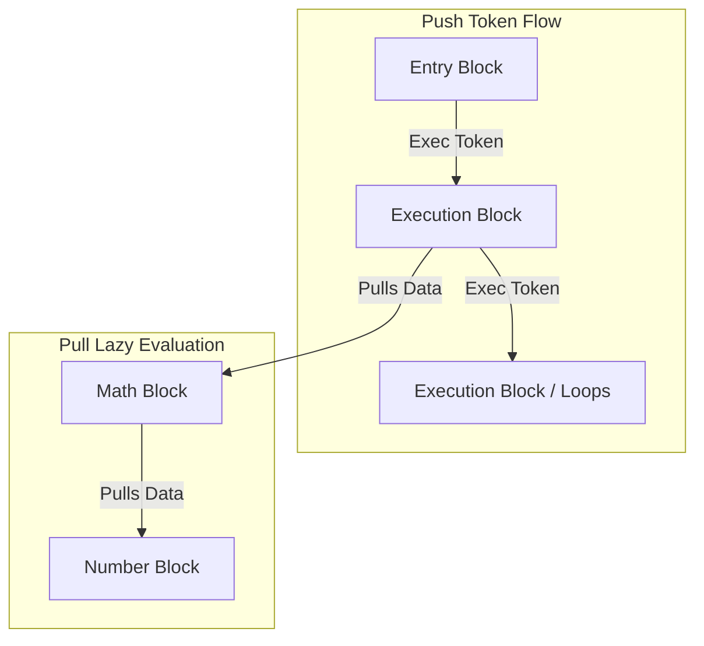

# ComfyLAB — Visual Lab Automation Environment

ComfyLAB (**Comf**ortable **L**ab **A**utomation **B**locks) is a visual, block-based software platform for automating scientific and test & measurement laboratory experiments. It allows researchers, students, and engineers to connect instruments, run analysis code, and view live plots using an intuitive drag-and-drop workspace.

---

## ✨ Features

- **Visual Block Programming**: Design automation procedures by connecting blocks together. No complex programming required.
- **Rich Block Library**: Extensive set of built-in blocks covering math, curve fitting, signal processing, array manipulation, control flow, file I/O, live plotting, instrument drivers, and utility functions.
- **Run Scripts in Other Languages**: Run code blocks written in Python, Rust, JavaScript, TypeScript, Julia, R, Lua, Octave, or Wolfram directly in your pipeline.
- **Equipment Control**: Connect and control physical laboratory hardware via VISA/SCPI protocol and dedicated instrument drivers.
- **Built-in Laboratory Safety**: If an automation run fails, is stopped, or encounters an error, ComfyLAB automatically triggers safety shutdown routines on instruments (e.g. turning off lasers or signal generator outputs) to protect your hardware.
- **Real-Time Live & Multi-Trace Graphs**: Stream data in real time with single and multi-trace live plotting widgets, custom axis limits, and persistent settings.
- **Whiteboard Canvas Overlay**: Draw diagrams, write notes, and add shapes directly on top of your workspace.
- **Custom Cluster Blocks**: Group a set of connected blocks into a single custom cluster block to keep your workspace clean and organized.
- **Security Protections**: Prevents untrusted blueprints from executing malicious scripts on your computer. You will be warned and asked for approval before running code from unknown sources.
- **Secure Remote Access**: Remotely access your lab setup PC running ComfyLAB, protected by a simple two-word token (user/password also available if needed).
- **Application Info & About Modal**: Access application details, license info, and versioning directly from the UI toolbar.

---

## 🧩 Block Categories & Capabilities

ComfyLAB provides a rich, modular ecosystem of blocks for building automation workflows:

- **Math & Curve Fitting**: Basic arithmetic, trigonometric & logarithmic functions, polynomial, exponential, gaussian, and custom non-linear curve fitting.
- **Logic & Control Flow**: Boolean operations (AND, OR, NOT, XOR), comparisons, execution branches (If/Else), For/While loops, and sequential execution blocks.
- **Data Structures & Arrays**: Lists, Dictionaries, and multi-dimensional NDArrays (reshaping, slicing, linear algebra, statistics, and array-to-image conversion).
- **Signal Processing**: FFT & power spectral analysis, bandpass/lowpass/highpass filtering, detrending, windowing, and peak finding algorithms.
- **File I/O & Storage**: Read and write CSV files, JSON data, and raw text files with automatic path resolution.
- **Visualization**: Interactive single and multi-trace line plots, scatter plots, and heatmaps/image viewers.
- **Instruments & VISA**: Direct VISA SCPI command/query execution and built-in drivers for oscilloscopes and signal generators.
- **Multi-Language Scripting**: Polyglot code execution blocks supporting 9 scripting languages (Python, Rust, JavaScript, TypeScript, Julia, R, Lua, Octave, Wolfram).
- **Clusters**: Group complex sub-graphs into custom reusable cluster blocks with dynamic input/output boundaries.
- **Utility & Timing**: Delays, timestamps, stopwatches, type conversion, console logging, and debugging inspectors.

---

## 🏗️ Technical Architecture

The execution engine uses a **Hybrid State Machine (Push/Pull)** model inspired by game engine blueprints (such as Unreal Engine Blueprints), allowing cycles/loops and branches while retaining lazy evaluation of math/logic pipelines.



### 1. Push Wires (Execution Token)
* Defined by connections of type `exec` between `ExecOut` and `ExecIn` pins.
* Wires push an "Execution Token" forward, specifying state changes and the sequential execution order.
* Execution path loops (cycles) are natively supported for operations like `ForLoop`.

### 2. Pull Wires (Lazy Evaluation Data Bus)
* Defined by connections of type `data` between `DataOut` and `DataIn` pins.
* Calculated **on demand (lazy evaluation)** when an execution block pulls data.
* Calculation results are cached *within a single execution step* to prevent redundant recalculation. Caching is cleared between execution steps.

### 3. VISA Concurrency (ResourceLockManager)
* Automating hardware requires calling blocking VISA APIs. 
* To prevent conflicts when multiple blocks access the same physical hardware concurrently, the `ResourceLockManager` manages async locks mapping `VISA address -> asyncio.Lock`.
* Safely resolves resource contentions with timeout/watchdog support to prevent deadlocks.

---

## 📂 Project Structure

```
ComfyLAB/  (root)
├── LICENSE                     # Software license (GPLv3)
├── README.md                   # This document
├── requirements.txt            # Python package dependencies
├── VERSION                     # Application version tracking
├── start.sh                    # Linux/macOS venv bootstrapper
├── start.bat                   # Windows venv bootstrapper
├── start.py                    # Cross-platform concurrent process coordinator
├── pyinstaller_entry.py        # PyInstaller application entry point
├── build_exe.py                # Builds the standalone single-file executable
├── build_release.py            # Builds the full release ZIP package
├── ComfyLAB.spec               # PyInstaller spec (frozen core + external blocks)
├── backend/                    # FastAPI API routers & WebSockets server
├── comfylab/                   # Core Python Engine
│   ├── engine/                 # Models, executor, lock manager, registry, security, config
│   └── blocks/                 # Block protocol (base), category modules (math, lists,
│                               #   ndarrays, logic, strings, io, signal, plots, visa, ...),
│                               #   scripting layers, cluster support, VISA instruments/
├── frontend/                   # Vite + React + React Flow web UI
└── tests/                      # Automated pytest integration & unit tests
```

---

## 🚀 Getting Started

You can run ComfyLAB either by downloading a pre-compiled release package or running directly from the source code.

### Option A: Pre-compiled Releases (Run-Ready)
For most users in the lab, this is the easiest way to run the software. It doesn't require compiling the React frontend or installing Node.js/Python manually.

#### A1: Standalone Single-File Binary (Zero-Dependency, limited to bundled python packages)
1. Download the pre-compiled `ComfyLAB.exe` (Windows) or `ComfyLAB` (Linux/macOS) binary from the **GitHub Releases** page.
2. Launch the application:
   * **Windows**: Double-click `ComfyLAB.exe`.
   * **Linux / macOS**: Make it executable (`chmod +x ComfyLAB`) and run `./ComfyLAB` in a terminal.
3. It will automatically start the server and open ComfyLAB in your default web browser at `http://localhost:8000`.

#### A2: Base Release Package (ZIP Archive, more freedom, extensible)
1. Download the latest release `.zip` package from the **GitHub Releases** page.
2. Extract the archive onto your computer.
3. Launch the application:
   * **Windows**: Double-click `start.bat`.
   * **Linux / macOS**: Open a terminal in the folder and run `bash start.sh`.
4. The bootstrapper script will automatically:
   * Set up an isolated Python virtual environment (`.venv`) locally in the directory.
   * Verify and install all Python dependencies from `requirements.txt`.
   * Start the backend and automatically open ComfyLAB in your default web browser at `http://localhost:8000`.
   * Cleanly terminate all processes when you close the terminal or press `Ctrl+C`.

---

### Option B: Running from Source (Developer Mode, most freedom, needs npm)
If you cloned the source code from GitHub:

1. Ensure you have **Python 3.8+** and **Node.js (npm)** installed on your machine.
2. Open a terminal in the repository root (`src/`) and run the bootstrapper:
   * **Linux / macOS**: `bash start.sh`
   * **Windows**: Run `start.bat` in Command Prompt.
3. The bootstrapper will:
   * Verify/initialize the local `.venv` environment and pip install requirements.
   * Detect that the pre-compiled frontend assets are missing and switch to **Development Mode**.
   * Run `npm install` inside the `frontend/` directory to fetch Node packages if missing.
   * Launch the FastAPI backend (port `8000`) and the Vite development server (port `5173`) concurrently.
   * Automatically open the browser to the hot-reloading development UI at `http://localhost:5173`.

---

### 🎛️ Command Line Arguments
You can customize the startup configuration by passing arguments to `start.sh` or `start.bat`. These arguments are automatically forwarded to the underlying process coordinator:

| Argument | Default | Description |
| :--- | :--- | :--- |
| `--port <int>` | `8000` | Port for the FastAPI backend (and the UI in production mode). |
| `--vite-port <int>` | `5173` | Port for the Vite dev server (development mode only). |
| `--local` | *(disabled)* | Restricts server access to localhost only (`127.0.0.1`). By default, ComfyLAB binds to `0.0.0.0` to allow remote network access from other computers on the lab network. |
| `--dev` | *(disabled)* | Forces Development Mode (runs the Vite dev server and FastAPI backend concurrently), even if a pre-compiled `frontend/dist` directory exists. |
| `--host <ip>` | `0.0.0.0` | Custom host binding address. |

---

## 📦 Building Releases (For Developers)

ComfyLAB provides automated build scripts in the root directory to generate production distribution packages.

### 1. Build Portable ZIP Package
To compile the frontend React bundle, stage the required production files (excluding test code, Node modules, and Python caches), and create a `.zip` archive:
```bash
python3 build_release.py
```
To automatically bump the version number before building:
```bash
python3 build_release.py --bump [patch|minor|major]
```
This generates `comfylab-release.zip` in your root directory.

### 2. Build Standalone Single-File Executable
To compile and package the entire application (Python interpreter, FastAPI backend, core packages, and precompiled frontend UI assets) into a single, zero-dependency executable (`ComfyLAB` or `ComfyLAB.exe`):
```bash
python3 build_exe.py
```
Optionally bump version before building:
```bash
python3 build_exe.py --bump [patch|minor|major]
```
This installs `pyinstaller` if missing and generates the compiled standalone binary inside the `dist/` directory.

---

## 🧪 Running the Verification Suite
To execute all unit and integration tests (validating the execution state machine, VISA resource locking, scripting sandboxes, and safety teardown routines):
```bash
python3 -m pytest tests/
```

---

## 📄 License

This project is licensed under the **GNU General Public License v3.0** - see the [LICENSE](LICENSE) file for details.

---

## 🤖 AI Assistance Disclosure

Portions of this codebase were developed with the assistance of AI coding tools. All design decisions, architecture, domain-specific logic, and final implementation choices were authored and reviewed by the project maintainer. AI tools were used as a productivity aid, in the same spirit as an IDE, a linter, or a documentation reference.
